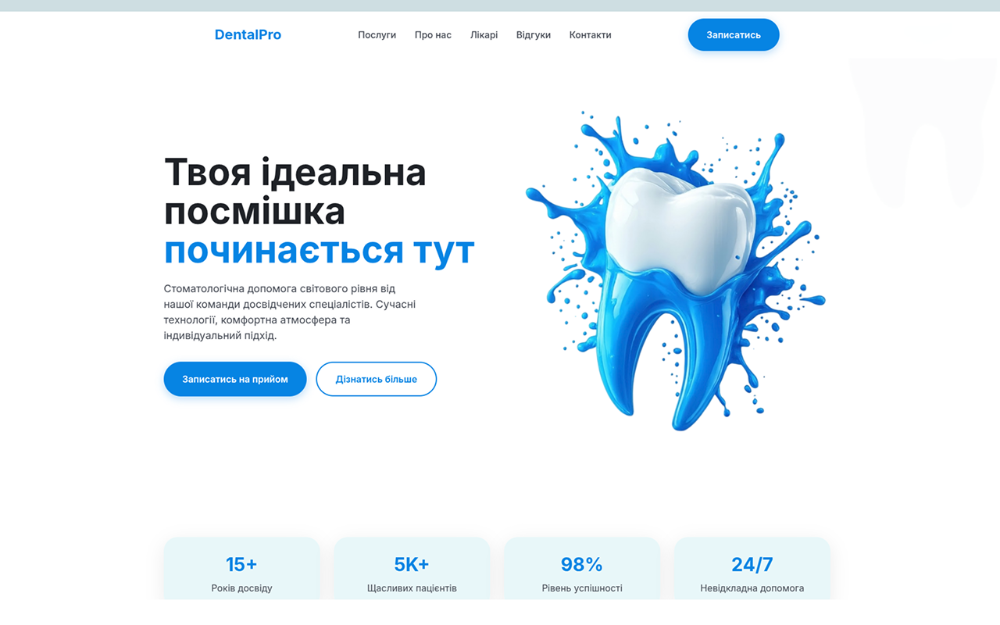

<div align="center">

# 🦷 DentalPro

**Сучасна стоматологічна клініка** — *Односторінковий лендінг з анімаціями, адаптивною версткою та реальними фото обладнання та лікарів.*

[](https://astro.build)
[](https://tailwindcss.com)
[](https://www.typescriptlang.org)

<br />

[Про проєкт](#-about) •
[Можливості](#-features) •
[Стек](#-tech-stack) •
[Архітектура](#-project-architecture) •
[Запуск](#-getting-started) •
[Збірка](#-build) •
[Дизайн система](#-design-system)

</div>

---

## 📖 About

**DentalPro** — односторінковий лендінг для стоматологічної клініки, створений на **Astro** з використанням **Tailwind CSS** та **TypeScript**. Проєкт включає 15 секцій: від героя та послуг до відгуків, FAQ та форми контакту.

```
┌──────────────────────────────────────┐
│  Hero · About · Services             │
│  Doctors · Equipment · Reviews       │
│  Before/After · Contact             │
└──────────────────────────────────────┘
```

Лендінг демонструє сучасний підхід до презентації медичної клініки: анімовані секції, інтерактивний слайдер "До/Після", карусель послуг та адаптивна mobile-first верстка.

---

## ✨ Features

| # | Feature | Details |
|:--:|---------|---------|
| 🎬 | **Hero секція** | Банер із закликом до дії та фото пацієнта |
| 📊 | **TrustBar** | Статистика клініки: роки досвіду, пацієнти, процедури |
| 🏥 | **About** | Про клініку з перевагами та підходом |
| 🧩 | **Advantages** | Bento-сітка переваг |
| 💎 | **Services** | Карусель послуг з цінами |
| 🖼️ | **Before/After** | Інтерактивний слайдер з drag-повзунком (3 кейси) |
| 👨‍⚕️ | **Doctors** | Спеціалісти клініки з фото |
| 📅 | **Timeline** | Етапи лікування |
| 🔧 | **Equipment** | Обладнання клініки (Primescan, Litetouch, ORIX) |
| ⭐ | **Reviews** | Відгуки пацієнтів |
| ❓ | **FAQ** | Акордеон з поширеними запитаннями |
| 📞 | **Contact** | Форма запису + контактна інформація |
| 🎨 | **Анімації** | FadeUp, FadeLeft, FadeRight, ScaleIn через IntersectionObserver |
| 📱 | **Адаптивність** | Повний mobile-first дизайн, кастомний скролбар |

---

## 🛠 Tech Stack

### Frontend & Core

| Layer | Technology | Version | Purpose |
|-------|-----------|---------|---------|
| **Framework** | Astro | `7.2.2` | Static site generation & island architecture |
| **Language** | TypeScript | `6.0` | Static typing через `astro/tsconfigs/strict` |
| **Styling** | Tailwind CSS | `4.1.0` | Utility-first CSS через `@tailwindcss/vite` |
| **Fonts** | Google Fonts (Inter) | — | Шрифти для headings та body |

### Інфраструктура

| Technology | Version | Purpose |
|------------|---------|---------|
| **Bundler** | Vite (via Astro) | JS/CSS бандлінг та HMR |
| **Hosting** | ihornone.site | Демо-версія проєкту |

---

## 📂 Project Architecture

```
ASTRO-DentalClinic/
│
├── astro.config.mjs                 # Конфігурація Astro + Tailwind Vite plugin
├── package.json                     # Залежності та скрипти
├── tsconfig.json                    # TypeScript (astro/tsconfigs/strict)
├── public/                          # Статичні активи
│   ├── favicon.svg
│   ├── icons.svg
│   ├── img-hero.png
│   ├── screenshots/                 # Скріншоти проєкту
│   │   ├── cover-image.png
│   │   ├── img-1.png ... img-7.png
│   ├── doc-1.jpg, doc-2.jpg, doc-3.jpg
│   ├── tools-1.jpg ... tools-4.jpg
│   └── 1-do.jpg, 1-pislya.jpeg, 2-do.jpeg, 2-pislya.jpeg, 3-do.jpeg, 3-pislya.jpeg
│
└── src/
    ├── layouts/
    │   └── Layout.astro             # HTML-обгортка, Google Fonts, meta-теги
    ├── pages/
    │   └── index.astro              # Головна сторінка (15 секцій)
    ├── styles/
    │   └── global.css               # Tailwind theme, кастомні класи, анімації
    └── components/
        ├── Animate.astro            # Анімаційні хелпери (IntersectionObserver)
        ├── Header.astro             # Навігація + мобільне меню
        ├── Hero.astro               # Банер
        ├── TrustBar.astro           # Статистика
        ├── About.astro              # Про клініку
        ├── Advantages.astro         # Переваги (Bento-сітка)
        ├── Services.astro           # Карусель послуг з цінами
        ├── BeforeAfter.astro        # Слайдер "до/після" з drag-повзунком
        ├── Doctors.astro            # Лікарі
        ├── Timeline.astro           # Етапи лікування
        ├── Equipment.astro          # Обладнання
        ├── Reviews.astro            # Відгуки
        ├── FAQ.astro                # Акордеон
        ├── CTA.astro                # CTA-блок
        ├── Contact.astro            # Форма + контакти
        └── Footer.astro             # Підвал
```

---

## 🚀 Getting Started

### Prerequisites

| Requirement | Version | Check |
|-------------|---------|-------|
| **Node.js** | `>= 18` | `node --version` |
| **npm** | (bundled) | `npm --version` |

### Installation

```bash
# 1. Клонувати репозиторій
git clone https://github.com/ihornone/ASTRO-DentalClinic.git
cd ASTRO-DentalClinic

# 2. Встановити залежності
npm install

# 3. Запустити dev-сервер
npm run dev
```

Відкрийте [http://localhost:4321](http://localhost:4321) у браузері.

---

## 📋 Available Scripts

| Script | Command | Description |
|--------|---------|-------------|
| `npm run dev` | `astro dev` | Запуск dev-серверу на `localhost:4321` |
| `npm run build` | `astro build` | Збірка продакшен-версії в `dist/` |
| `npm run preview` | `astro preview` | Попередній перегляд збірки |
| `npm run astro` | `astro` | Доступ до CLI Astro |

---

## 🔧 Build

### Development

```bash
npm run dev
```

### Production

```bash
npm run build    # Збірка в dist/
npm run preview  # Локальний превью збірки
```

### Деплой

Проєкт доступний за адресою: [dental-clinic.ihornone.site](https://dental-clinic.ihornone.site)

---

## 🎨 Design System

### Color Palette

| Token | Hex | Usage |
|-------|-----|-------|
| **Primary** | `#0185e4` | Кнопки, акценти, посилання |
| **Primary Dark** | `#016bb5` | Hover-состояния |
| **Primary Light** | `#b8ddfa` | Світлі акценти |
| **Secondary** | `#00677f` | Другорядна інформація |
| **Surface** | `#e3f5f8` | Фон сторінки |
| **Surface Container** | `#e8eeff` | Контейнери, картки |
| **On Surface** | `#191c22` | Основний текст |
| **On Surface Variant** | `#424752` | Додатковий текст |

### Typography

| Style | Size | Weight | Usage |
|-------|------|--------|-------|
| **Headline XL** | `64px` | Bold | Hero заголовок |
| **Headline LG** | `48px` | Bold | Заголовки секцій |
| **Headline MD** | `24px` | SemiBold | Підзаголовки, назви карток |
| **Body LG** | `18px` | Regular | Описовий текст |
| **Body MD** | `16px` | Regular | Основний текст |
| **Label MD** | `14px` | Medium | Мітки, маленькі елементи |
| **Stats Number** | `32px` | Bold | Цифри в статистиці |

### Spacing & Radius

| Property | Value |
|----------|-------|
| **Section Gap** | `py-24 md:py-32` |
| **Container Max** | `max-w-7xl` |
| **Card Radius** | `rounded-3xl` / `rounded-[2rem]` |
| **Button Radius** | `rounded-full` |
| **Screen Padding** | `p-3 md:p-5` |

---

## 🔬 Technical Deep Dive

### Анімаційна система

```typescript
Animate({ direction?: 'up' | 'left' | 'right' | 'scale', delay?: number, stagger?: boolean })
```

Компонент використовує **IntersectionObserver** для запуску анімацій при вході в viewport:

| Анімація | Клас | Опис |
|---------|------|------|
| Fade Up | `anim-fade-up` | З'явлення знизу |
| Fade Left | `anim-fade-left` | З'явлення зліва |
| Fade Right | `anim-fade-right` | З'явлення справа |
| Scale In | `anim-scale-in` | Масштабування з 0.9 до 1 |

### Before/After Слайдер

Інтерактивний слайдер реалізовано на чистому TypeScript з підтримкою drag-повзунка та touch-подій:

- **3 кейси** — Відбілювання, Коронка, Ортодонтія
- **Drag-повзунок** — mouse + touch events
- **Навігація** — кнопки prev/next + dots

---

## 🤝 Contributing

Це приватний проєкт. Якщо у вас є доступ і ви хочете запропонувати зміни:

1. 🍴 Зробіть fork репозиторію
2. 🌿 Створіть гілку (`git checkout -b feature/amazing-feature`)
3. 💻 Внесіть зміни
4. ✅ Перевірте роботу (`npm run dev`)
5. 📝 Закомітьте (`git commit -m 'feat: add amazing feature'`)
6. 🚀 Відправте (`git push origin feature/amazing-feature`)
7. 🔄 Відкрийте Pull Request

---

<p align="center">
  <sub>Built with ❤️ using Astro · Tailwind CSS · TypeScript</sub>
  <br />
  <sub>© 2026 ihornone</sub>
</p>
